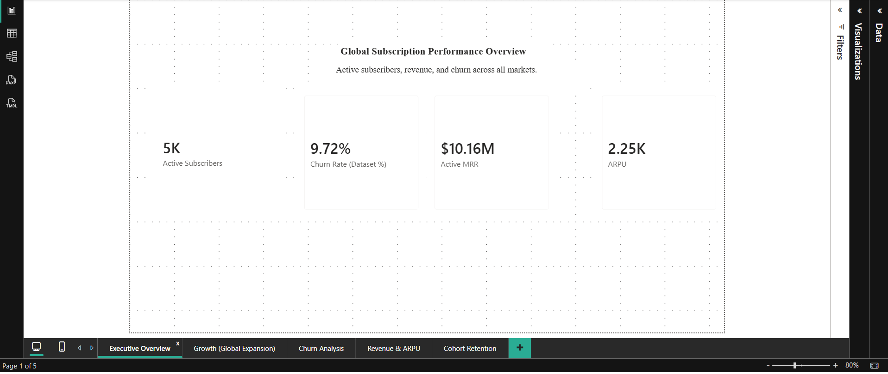
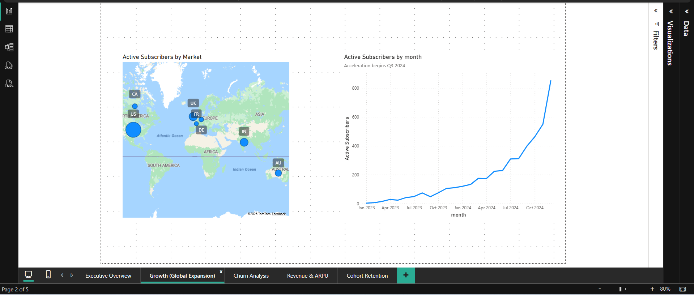
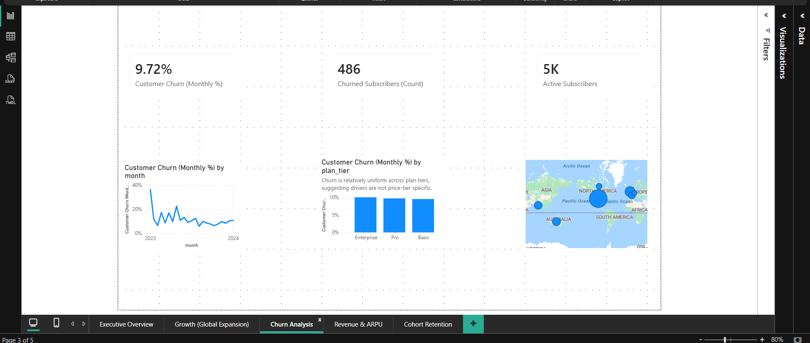
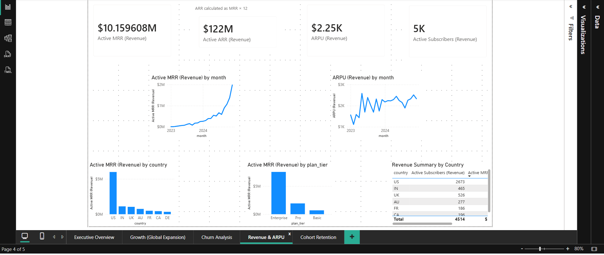
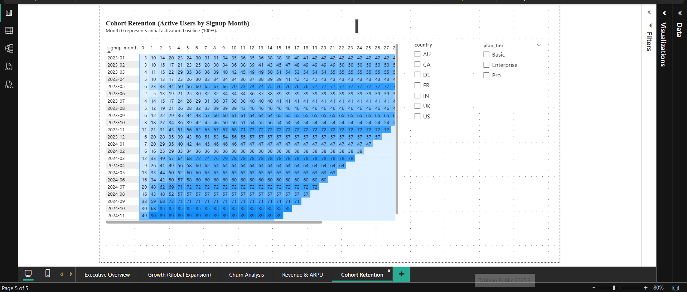

## SaaS Retention & Churn Analysis
### Overview

This project analyzes subscription retention trends to identify churn patterns, revenue risk areas, and long-term stability across customer segments. The goal was to move beyond surface churn percentages and understand where retention declines were concentrated and what factors influenced customer longevity.

### Business Questions

Where does retention decline most significantly across lifecycle stages?

How do plan tiers compare in long-term stability?

Are certain regions experiencing accelerated churn?

What early indicators suggest long-term revenue risk?

### Tools Used

Power BI (data modeling, DAX, dashboard design)

SQL (data extraction and transformation)

Excel (data cleaning and validation)

### Key Insights

Retention declines steadily after early lifecycle stages across most cohorts.

Enterprise plans demonstrate stronger long-term retention compared to basic plans.

Certain regions show higher churn velocity, suggesting potential pricing or engagement misalignment.

Early drop-off patterns strongly correlate with long-term revenue instability.

## Dashboard Preview
### Executive Overview

### Growth & Global Expansion

### Churn Analysis

### Revenue & ARPU

### Cohort Retention

## Files Included

Power BI dashboard file (.pbix)

Cleaned and enriched datasets (.csv)

Dashboard screenshots for quick review
